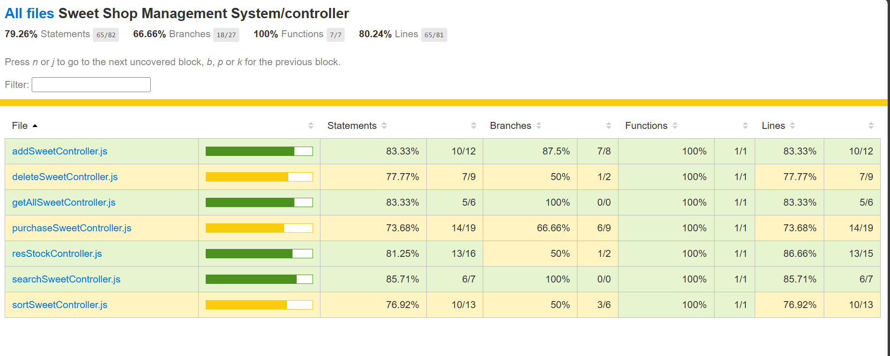
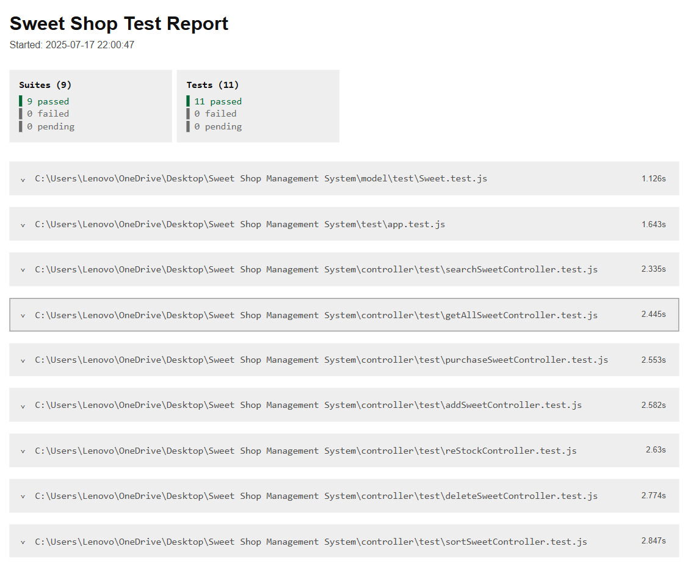

# 🍬 Sweet Shop Management System

A Sweet Shop Management System built using **Node.js**, **Express**, **MongoDB**, and **Jest (TDD)** as a part of Incubite's take-home assignment. This project allows admins (vendors) to manage sweets — add, delete, restock, sort, and view — with a focus on clean code, modularity, and **Test-Driven Development**.

---

## Test Report

## 

## 

## 🗂️ Folder Structure

```
Sweet Shop Management System
│
├── config
│ └── db.js
│
├── controller
│ ├── addSweetController.js
│ ├── deleteSweetController.js
│ ├── getAllSweetController.js
│ ├── purchaseSweetController.js
│ ├── reStockSweetController.js
│ ├── searchSweetController.js
│ ├── sortSweetController.js
│ └── test
│ ├── addSweetController.test.js
│ ├── deleteSweetController.test.js
│ ├── getAllSweetController.test.js
│ ├── purchaseSweetController.test.js
│ ├── reStockController.test.js
│ ├── searchSweetController.test.js
│ └── sortSweetController.test.js
│
├── model
│ ├── Sweet.js
│ └── test
│ └── Sweet.test.js
│
├── routes
│ └── sweetRouter.js
│
├── coverage
│ └── lcov-report/ (generated test coverage report)
│
├── reports
│ └── test-report.html (optional HTML report)
│
├── test
│ └── app.test.js
│
├── .env
├── .gitignore
├── app.js
├── index.js
├── jest.config.js
├── package.json
├── package-lock.json
└── README.md

```

---

## ⚙️ Tech Stack

### 🔧 Backend

- Node.js
- Express.js
- MongoDB with Mongoose
- Jest (for Testing)

### 🧪 Testing

- Jest
- Supertest

## 🚀 Setup Instructions

### 1. Clone the Repository

```bash
git clone https://github.com/Ron12-star/Sweet-Shop.git
cd sweet-shop-management-system
```

### 2. Install Dependencies

```bash
npm install
```

### 3. Setup Environment Variables

Create a `.env` file in the root directory and add the following:

```env
PORT=8080
MONGO_URI=mongodb://localhost:27017/sweetshop
```

### 4. Run the App

```bash
npm start
```

Server will be live at [http://localhost:8080](http://localhost:8080)

---

## 🧪 Run Tests

### All tests:

```bash
npm test
```

### Single test file:

```bash
npx jest controller/test/addSweetController.test.js
```

## 🛠 API Endpoints
```


| Method | Endpoint              | Description                        |
| ------ | --------------------- | ---------------------------------- |
| POST   | `/sweet/add`          | Add a new sweet                    |
| GET    | `/sweet/view`         | View all sweets                    |
| DELETE | `/sweet/delete/:id`   | Delete a sweet                     |
| PATCH  | `/sweet/restock/:id`  | Restock a sweet                    |
| GET    | `/sweet/sort?sortBy=` | Sort sweets (price, qty, category) |


```

## 📌 Features

- Add, view, delete, and restock sweets
- Sort sweets by price, quantity, or category
- Built with TDD using Jest
- Clean MVC folder structure

---

## 📥 Contributions

Feel free to fork and contribute by submitting a pull request 🙌
